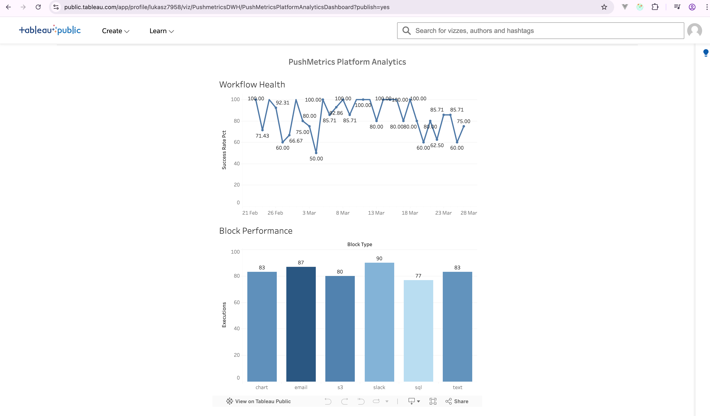
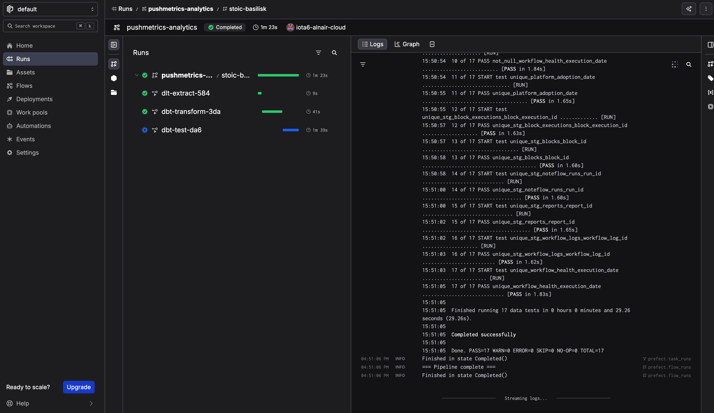

# PushMetrics Platform Analytics Pipeline

End-to-end data engineering pipeline that extracts operational metrics from the PushMetrics Query.me platform, loads them into a columnar data lake on S3, and serves analytics via AWS Athena + dbt transformations.

## Problem Statement

PushMetrics Query.me is a collaborative SQL editor and reporting platform. As usage grows, we need visibility into:

- **Workflow reliability** — Which workflows fail most? What's the average execution time trend?
- **Block performance** — Which block types are slowest? Where are the bottlenecks?
- **Platform adoption** — How are reports, blocks, and workflows being used over time?

This pipeline answers these questions by building an automated, daily analytics pipeline from the production PostgreSQL database to an Athena-based warehouse with dbt-modeled marts and Tableau dashboards.

## Architecture

```
PostgreSQL (source database)
    │
    ▼
[Extraction] ─── dlt (incremental, with PII anonymization)
    │
    ▼
[Data Lake] ──── S3 (Parquet, partitioned by date + workspace)
    │              + DuckDB for local ad-hoc exploration
    ▼
[Warehouse] ──── AWS Athena (serverless, columnar via Parquet)
    │              + AWS Glue Data Catalog
    ▼
[Transforms] ─── dbt (dbt-athena adapter)
    │              staging (5 views) → marts (3 tables)
    ▼
[Dashboard] ──── Tableau Public
    │
[Orchestration] ─ Prefect 3 (Prefect Cloud for monitoring + scheduling)
```

## Dashboard

**[View live dashboard on Tableau Public](https://public.tableau.com/app/profile/lukasz7958/viz/PushmetricsDWH/PushMetricsPlatformAnalyticsDashboard)**



Two main views:

1. **Workflow Health** (temporal) — Daily workflow success rate over time, showing reliability trends
2. **Block Performance** (categorical) — Execution count by block type (chart, email, s3, slack, sql, text)

## Orchestration

The pipeline uses **Prefect 3** for orchestration, tracked in **Prefect Cloud**:



- **Flow**: `pushmetrics-analytics` — 3 tasks (extract → transform → test)
- **Retries**: Extraction retries 2x (60s delay), transforms retry 1x (30s delay)
- **Monitoring**: Prefect Cloud UI shows run history, logs, task durations

```
Prefect Cloud (monitoring + scheduling)
    │
    ▼
Pipeline Flow (local or K8s)
    ├── Task 1: dlt extract (PG → S3 Parquet)
    ├── Task 2: dbt run (staging → marts on Athena)
    └── Task 3: dbt test (data quality validation)
```

## Tech Stack

| Component | Technology | Justification |
|-----------|-----------|---------------|
| Extraction | [dlt](https://dlthub.com/) | Schema evolution, incremental loads, built-in Parquet + S3 destination |
| Data Lake | S3 + Parquet | Columnar, compressed, partitioned — native to AWS ecosystem |
| Warehouse | AWS Athena | Serverless, queries S3 Parquet directly, ~$0 at our data volume |
| Catalog | AWS Glue | Required by Athena, Terraform-managed |
| Transforms | dbt (dbt-athena) | Industry standard, version-controlled SQL transformations |
| Dashboard | Tableau Public | Interactive dashboards, publicly shareable |
| Orchestration | Prefect 3 + Prefect Cloud | Flow-based orchestration with retries and monitoring |
| IaC | Terraform | S3 bucket, Glue database, Athena workgroup, IAM roles |
| Exploration | DuckDB | Local Parquet analysis without Athena costs |

## Data Sources (PushMetrics PostgreSQL)

All data is anonymized at extraction time — user IDs are hashed, no PII is stored.

| Source Table | Extracted Fields | Purpose |
|---|---|---|
| `workflow` | id, workspace_id, cron_rule, is_active, created_on | Workflow configurations |
| `workflow_log` | id, workflow_id, status, start_time, end_time, progress | Execution history |
| `noteflow_run` | id, workspace_id, status, start_time, end_time | Run-level metrics |
| `noteflow_run_task` | id, run_id, status, start_time, end_time | Task-level metrics |
| `block_execution` | id, block_id, block_type, start_date, end_date, status | Block performance |
| `report` | id, workspace_id, created_on, changed_on | Report metadata |
| `report_block` | report_id, block_id, block_type | Report composition |
| `block` | id, type, workspace_id, created_on | Block inventory |
| `logs` | action, user_id (hashed), dttm | Platform action log |

## Project Structure

```
project/
├── README.md
├── Makefile                        # Common commands
├── Dockerfile                      # Pipeline container
├── docker-compose.yml              # Local dev (source Postgres)
├── .env.example                    # Required environment variables
├── terraform/
│   ├── main.tf                     # S3, Glue, Athena, IAM
│   ├── variables.tf
│   └── outputs.tf
├── pipeline/
│   ├── __init__.py
│   ├── flow.py                     # Prefect flow (extract → transform → test)
│   ├── extract.py                  # dlt pipeline definition
│   ├── anonymize.py                # PII hashing utilities
│   ├── sources.py                  # dlt source/resource definitions
│   ├── create_athena_tables.py     # Create Athena external tables
│   ├── config.toml                 # dlt configuration
│   ├── secrets.toml.example        # dlt secrets template
│   └── requirements.txt            # Python dependencies
├── transform/
│   ├── dbt_project.yml
│   ├── profiles.yml
│   └── models/
│       ├── staging/                # stg_workflow_logs, stg_block_executions, ...
│       └── marts/                  # workflow_health, block_performance, platform_adoption
├── explore/
│   ├── analysis.py                 # DuckDB exploration scripts
│   └── export_csvs.py             # Export Athena marts to CSV
├── screenshots/
│   ├── prefect_pipeline_run.png    # Prefect Cloud flow run
│   └── tableau_dashboard.png       # Tableau Public dashboard
├── helm/
│   └── analytics-pipeline/         # Helm chart for K8s deployment
└── .github/
    └── workflows/
        └── ci.yml                  # Lint, test, build + push Docker image
```

## Setup

### Prerequisites

- AWS account with permissions for S3, Glue, Athena, IAM
- Terraform >= 1.5
- Python 3.12+ (pyenv recommended)
- Docker
- Prefect Cloud account (free tier)

### 1. Infrastructure

```bash
cd terraform
cp terraform.tfvars.example terraform.tfvars  # Set your AWS region, EKS OIDC values
terraform init
terraform plan
terraform apply
```

This creates: S3 bucket, Glue database, Athena workgroup, IAM role with S3/Glue/Athena policies.

### 2. Local Development

```bash
# Start local source database
docker-compose up -d

# Create Python environment
pyenv local 3.12.11
python -m venv venv
source venv/bin/activate
pip install -r pipeline/requirements.txt

# Configure credentials
cp .env.example .env                          # Fill in database credentials
cp pipeline/secrets.toml.example .dlt/secrets.toml  # Fill in PostgreSQL + AWS credentials
```

### 3. Run the Pipeline

```bash
# Run extraction only
python -m pipeline.extract

# Run full Prefect flow (extract → transform → test)
python -m pipeline.flow
```

### 4. Create Athena Tables

After the first extraction to S3:

```bash
python -m pipeline.create_athena_tables
```

### 5. Run dbt

```bash
./venv/bin/dbt run --project-dir transform --profiles-dir transform
./venv/bin/dbt test --project-dir transform --profiles-dir transform
```

### 6. Prefect Cloud

```bash
prefect cloud login
python -m pipeline.flow    # Flow runs are tracked in Prefect Cloud UI
```

### 7. Explore with DuckDB

```bash
python explore/analysis.py
```

## dbt Models

### Staging (5 views)
| Model | Source | Derived Fields |
|---|---|---|
| `stg_workflow_logs` | `workflow_log` | `duration_seconds`, `is_success`, `execution_date` |
| `stg_block_executions` | `block_execution` | `duration_seconds`, `is_success`, `execution_date` |
| `stg_noteflow_runs` | `noteflow_run` | `duration_seconds`, `is_success`, `execution_date` |
| `stg_blocks` | `block` | `created_date` |
| `stg_reports` | `report` | `created_date` |

### Marts (3 tables)
| Model | Purpose | Dashboard Tile |
|---|---|---|
| `workflow_health` | Daily success rate, avg/p50/p95 duration | Workflow Health (temporal) |
| `block_performance` | Executions and success rate by block type | Block Performance (categorical) |
| `platform_adoption` | Daily new reports, blocks, active workspaces | — |

### Data Tests
17 data tests validate uniqueness and not-null constraints across all models.

## Reproducibility

```bash
# Full setup from scratch
docker-compose up -d                          # Start local Postgres
pyenv local 3.12.11 && python -m venv venv && source venv/bin/activate
pip install -r pipeline/requirements.txt
cd terraform && terraform init && terraform apply  # AWS resources
cd ..
python -m pipeline.extract                    # Extract to S3
python -m pipeline.create_athena_tables       # Register tables in Athena
./venv/bin/dbt run --project-dir transform --profiles-dir transform
./venv/bin/dbt test --project-dir transform --profiles-dir transform
prefect cloud login && python -m pipeline.flow  # Full orchestrated run
```

## Design Decisions

### Why Athena over Redshift?
At our data volume (~50K-100K rows/day), Redshift Serverless minimum costs exceed Athena's per-query pricing by 10-100x. Athena queries S3 Parquet directly — no server, no idle costs. We get columnar storage benefits (Parquet) and partitioning (Hive-style on S3) without warehouse management overhead.

### Why Prefect over Airflow?
We already use Prefect in the PushMetrics platform. A Prefect flow is a single Python function vs Airflow's 3+ components (scheduler, webserver, database). Prefect Cloud provides scheduling and monitoring UI for free, eliminating self-hosted infrastructure. The pipeline is 3 tasks — Airflow's DAG complexity is unnecessary here.

### Why dlt over custom scripts?
dlt handles schema evolution, incremental loading (merge/append strategies), and has native S3+Parquet destination support. Writing custom `psycopg2 → boto3 → parquet` code would require reimplementing all of this.

### Why hash user IDs instead of dropping them?
Hashed IDs preserve cardinality for user-level analytics (DAU, retention) without exposing PII. We can count unique users and track behavior patterns without knowing who they are.
